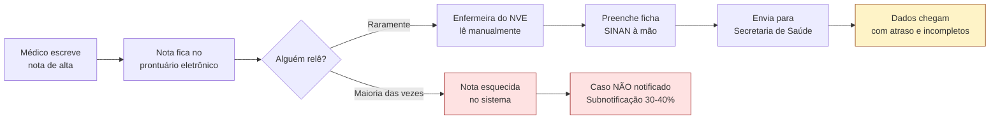
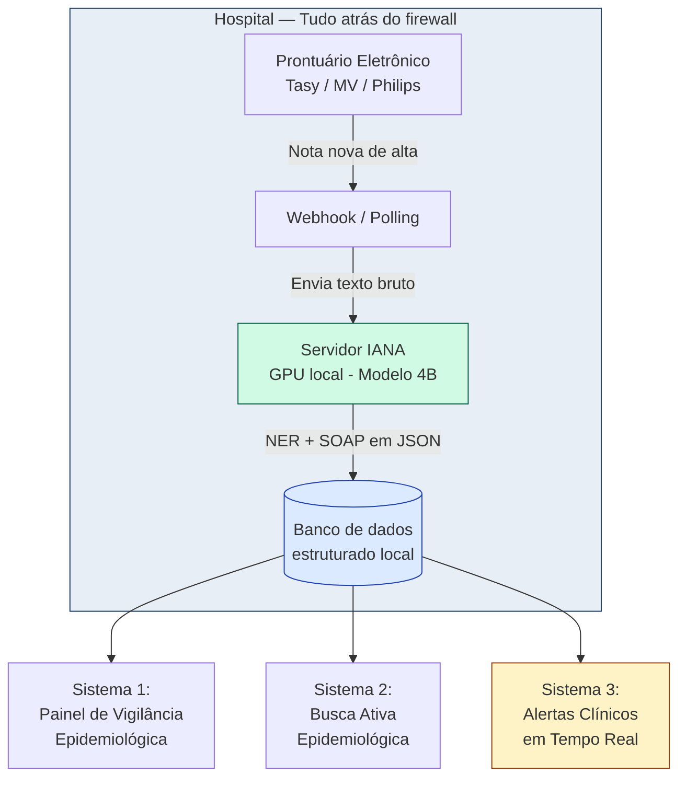
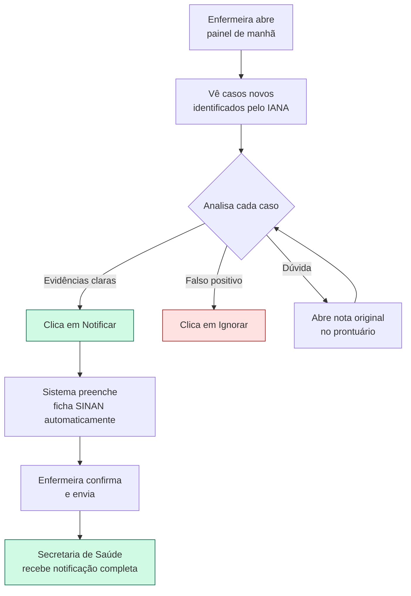
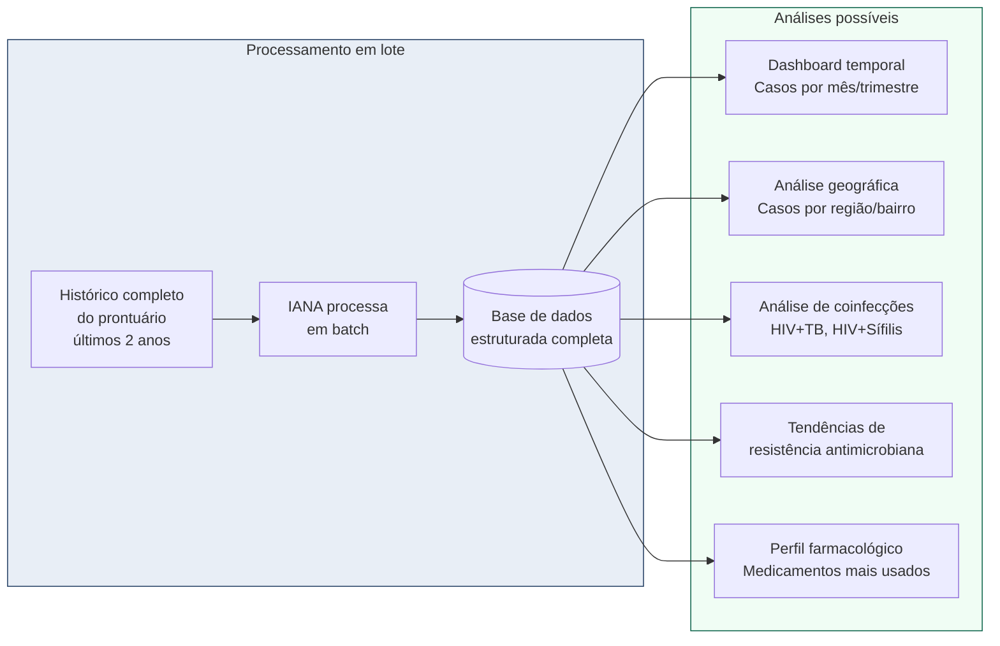
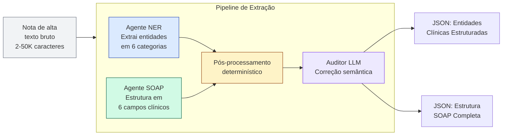
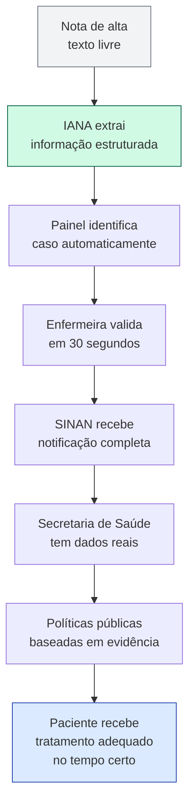
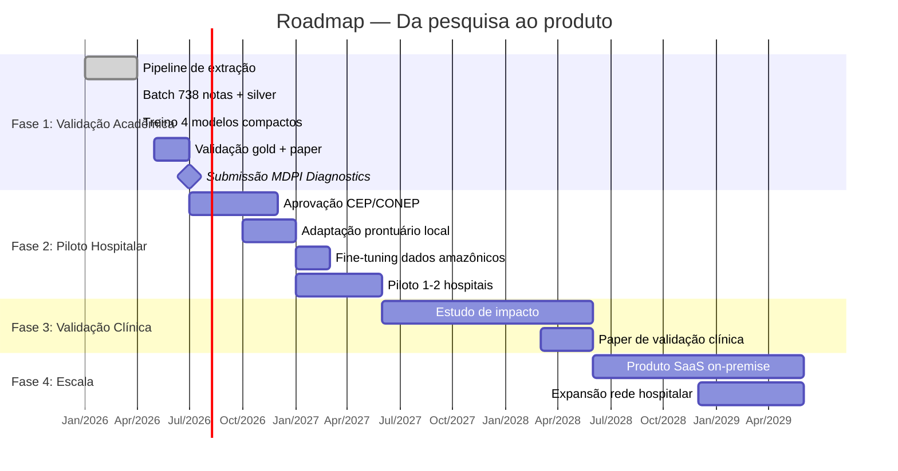
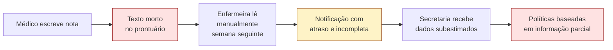
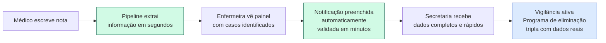
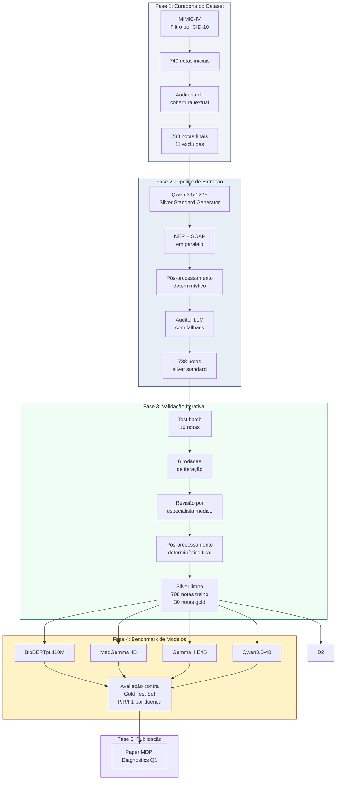

# Projeto IANA — Visão Prática e Aplicação Hospitalar

**Como a pipeline de extração de informação clínica vai funcionar no dia a dia de um hospital real, quem usa, que problema resolve e que valor entrega.**

*Vigilância epidemiológica automatizada para HIV, Tuberculose e Sífilis*
*Documento de visão estratégica — Abril de 2026*

---

## 1. O problema que existe hoje, sem o IANA

Imagine um hospital público de médio porte em Manaus. Todo dia, entre 30 e 50 pacientes recebem alta. Cada alta gera uma nota de discharge summary — um texto livre de 2 a 10 páginas que o médico escreve contando tudo que aconteceu durante a internação: queixa, exames, diagnósticos, tratamento, orientações.

Essas notas vão para o prontuário eletrônico e, na maioria dos casos, ficam lá mortas. Ninguém relê. O médico do ambulatório vai ver um resumo curto na próxima consulta. O epidemiologista do hospital nunca vai ler porque são centenas de notas por semana.

Agora o problema concreto: HIV, TB e Sífilis são doenças de notificação compulsória no Brasil. Toda vez que um caso é diagnosticado, o hospital é obrigado por lei a notificar a Secretaria de Saúde via SINAN. Mas quem faz isso hoje? Geralmente uma ou duas enfermeiras no Núcleo de Vigilância Epidemiológica do hospital, que precisam:

- Ler prontuários manualmente procurando casos novos
- Preencher fichas de notificação à mão
- Enviar para a Secretaria de Saúde
- Acompanhar o follow-up (o paciente compareceu ao tratamento? está aderindo?)

Isso é lento, incompleto e não escala. Estima-se que a subnotificação de tuberculose no Brasil é de 30 a 40% — ou seja, 3 a 4 em cada 10 casos diagnosticados não são reportados ao SINAN. Para sífilis congênita, o cenário é ainda pior. Isso significa que o sistema de vigilância brasileiro opera com informação incompleta, e políticas públicas são baseadas em dados subestimados.

> **Esse é exatamente o problema que o IANA resolve: transformar notas clínicas livres em informação estruturada automática, permitindo que a vigilância epidemiológica seja rápida, completa e escalável.**

### Fluxo atual — sem automação

---

## 2. Como o IANA roda dentro do hospital — dia a dia

### 2.1 Integração com o prontuário eletrônico

O hospital usa algum sistema de prontuário eletrônico (Tasy, MV, Philips, ou sistema próprio). O IANA roda como um serviço ao lado, não dentro do prontuário. Toda vez que um médico finaliza uma alta, o sistema dispara um webhook ou o IANA faz polling perguntando "tem nota nova? me envia."

### 2.2 Processamento local

**Isso é importante:** a nota é processada dentro do hospital, em um servidor local. Nada de dados saindo para nuvem, nada de enviar para API da OpenAI ou Google. Isso é crítico porque são dados de saúde protegidos pela LGPD brasileira e, quando o hospital é público, pela Lei de Acesso à Informação.

O modelo roda em um servidor ou estação de trabalho dentro do hospital, atrás do firewall institucional. Esta é uma das razões pelas quais estamos treinando modelos compactos de 4 bilhões de parâmetros ou menores — eles rodam em hardware modesto, tipo uma GPU RTX 4090, ou até em CPU robusta para os modelos menores.

### 2.3 Tempo de processamento

Cada nota leva entre 5 segundos e 2 minutos para ser processada, dependendo do tamanho do texto e do modelo escolhido. Para um hospital com 50 altas por dia, isso significa menos de 2 horas de processamento total, rodando em background, sem interferir no trabalho clínico.

### 2.4 O que o IANA produz

Para cada nota, o IANA gera dois outputs estruturados em formato JSON:

- **Lista de entidades clínicas** — doenças, sintomas, medicamentos, exames, organismos, procedimentos
- **Estrutura SOAP completa** — as 6 seções organizadas (Subjetivo, Objetivo-Exame Físico, Objetivo-Laboratório, Objetivo-Imagem, Avaliação e Plano)

Esse JSON vai para um banco de dados local do hospital e alimenta três sistemas diferentes, descritos nas próximas seções.

### Arquitetura geral do IANA no hospital

> **Nota:** o Sistema 3 (Alertas Clínicos em Tempo Real) está fora do escopo do paper atual. Ele é uma evolução futura do projeto.

---

## 3. Sistema 1 — Painel de vigilância epidemiológica

### Quem usa

Enfermeira ou enfermeiro do Núcleo de Vigilância Epidemiológica do hospital, ou médico infectologista responsável pela vigilância.

### O que o painel mostra

Uma tela com casos identificados automaticamente nas últimas 24 horas, 7 dias e 30 dias. Separado por doença. Cada caso tem:

- ID do paciente
- Data da alta
- Confiança do sistema (alta quando há múltiplas evidências, média quando há menos)
- **Evidências extraídas:** por exemplo, "Carga viral HIV: 218.000", "Cultura de escarro positiva para M. tuberculosis", "RPR reativo 1:128"
- Link direto para a nota original no prontuário
- Status de notificação: notificado, pendente ou ignorado

### O que o usuário faz

Em vez de ler 50 notas por dia procurando casos, a enfermeira abre o painel de manhã e vê 3 casos novos de HIV, 1 de TB, 0 de sífilis. Ela clica em cada um, confere a nota original em 30 segundos, e decide: notificar ou ignorar (se for falso positivo ou caso já notificado).

Quando ela clica em "notificar", o sistema **preenche automaticamente a ficha de notificação do SINAN** com as informações que o IANA extraiu, e ela só precisa confirmar e enviar.

### Impacto concreto

> O que antes levava 8 horas por semana de leitura manual agora leva 30 minutos. A taxa de identificação de casos aumenta de aproximadamente 60% (manual) para 90% (assistida pelo sistema).

### Fluxo do painel de vigilância

---

## 4. Sistema 2 — Busca ativa epidemiológica

### Quem usa

Gestor do hospital, Secretaria Municipal de Saúde, pesquisadores em saúde pública.

### O que faz

O IANA processa não só notas novas, mas também o histórico do prontuário eletrônico. Isso permite perguntas que hoje são impossíveis de responder rapidamente:

- "Quantos pacientes com coinfecção HIV+TB internaram nos últimos 12 meses?"
- "Qual a distribuição geográfica dos casos de sífilis identificados neste hospital nos últimos 2 anos?"
- "Houve aumento de casos de TB resistente nos últimos 6 meses?"
- "Quais medicamentos antirretrovirais são mais prescritos neste hospital e há alguma tendência de mudança?"

Hoje essas perguntas exigem que um pesquisador passe semanas lendo prontuários manualmente ou peça para o TI fazer extrações específicas. Com o IANA, são consultas SQL direto na base estruturada. A resposta sai em segundos.

### Impacto concreto

> A Secretaria de Saúde consegue fazer vigilância **ativa** em vez de **passiva**. Quando identifica um padrão estranho (ex: aumento súbito de sífilis em uma região), consegue investigar em dias em vez de meses.

### Fluxo da busca ativa

---

## 5. Sistema 3 — Alertas clínicos em tempo real (visão futura)

Esta aplicação está fora do escopo do paper atual, mas é o cenário onde o IANA evolui de ferramenta epidemiológica para ferramenta clínica.

### Quem usa

Médicos assistentes, em tempo real durante o atendimento.

### O que faz

Enquanto o médico está escrevendo a nota de alta (ou mesmo uma evolução diária), o IANA processa o texto em background e sugere:

- "Paciente com CD4 < 200 e sem profilaxia para PCP registrada. Considerar iniciar Sulfametoxazol-Trimetoprima?"
- "Coinfecção HIV+TB detectada. Iniciar TARV após 2 semanas de RIPE conforme diretriz do Ministério da Saúde?"
- "Paciente com sífilis ativa e gestante. Já foi realizado tratamento do parceiro?"

Isso não substitui o julgamento clínico — são lembretes baseados em protocolos, não prescrições. Mas em hospitais sobrecarregados, onde médicos atendem 40 pacientes em uma tarde, esses lembretes reduzem erros de omissão.

---

## 6. O que os modelos treinados são capazes de fazer

### 6.1 Capacidade 1: Extração de entidades clínicas (NER)

Todos os 4 modelos do benchmark aprendem a receber uma nota de alta e devolver listas estruturadas de:

- **Doenças e síndromes** identificadas no paciente
- **Sinais e sintomas** observados
- **Medicamentos** prescritos e em uso
- **Exames laboratoriais** realizados, com valores
- **Procedimentos diagnósticos** feitos no paciente
- **Organismos e vírus** confirmados como causa de infecção

**Exemplo prático:**

Texto de entrada:
> "Paciente feminina de 45 anos admitida por febre há 5 dias e tosse produtiva com hemoptise. TC de tórax mostra cavitação em lobo superior direito. Cultura de escarro positiva para Mycobacterium tuberculosis. Iniciado esquema RIPE (rifampicina, isoniazida, pirazinamida, etambutol)."

Output do modelo:

| Categoria | Entidades extraídas |
|---|---|
| Doenças | Tuberculose pulmonar |
| Sinais/Sintomas | Febre, Tosse produtiva, Hemoptise, Cavitação em lobo superior direito |
| Medicamentos | Rifampicina, Isoniazida, Pirazinamida, Etambutol |
| Laboratório | Cultura de escarro positiva para M. tuberculosis |
| Procedimentos | Tomografia computadorizada de tórax |
| Organismos | Mycobacterium tuberculosis |

### 6.2 Capacidade 2: Estruturação SOAP (apenas os 3 decoders)

Além de extrair entidades, os modelos geradores (MedGemma, Gemma 4, Qwen3.5-4B) aprendem a organizar o texto bruto em formato SOAP. Isso é uma tarefa mais complexa porque exige geração de texto coerente, não só classificação.

O modelo recebe a mesma nota bruta e devolve 6 campos organizados:

- **Subjetivo:** "Paciente feminina de 45 anos relata febre há 5 dias e tosse produtiva com hemoptise recente."
- **Objetivo — Exame físico:** (sinais vitais, ausculta, etc.)
- **Objetivo — Laboratório:** "Cultura de escarro positiva para M. tuberculosis."
- **Objetivo — Imagem:** "TC de tórax: cavitação em lobo superior direito."
- **Avaliação:** "Tuberculose pulmonar confirmada por cultura, com envolvimento cavitário."
- **Plano:** "Esquema RIPE iniciado. Notificação compulsória ao serviço de vigilância."

> **BioBERTpt não gera SOAP** porque é um modelo encoder (classificação de tokens), não gerador. Entra no benchmark apenas para NER. Os 3 decoders (MedGemma, Gemma 4 E4B e Qwen3.5-4B) geram NER e SOAP.

### Fluxo de processamento por nota

---

## 7. Quem ganha o quê, concretamente

### Médicos

Ganham tempo. Não precisam mais preencher fichas de notificação manualmente. Podem focar em atender pacientes.

### Enfermeiras de vigilância epidemiológica

Deixam de ser "leitoras profissionais de prontuários" e passam a ser validadoras de casos automaticamente identificados. Trabalho mais qualificado, menos repetitivo.

### Gestores de hospital

Ganham visibilidade sobre indicadores de infecção oportunista, coinfecções, tendências temporais. Podem tomar decisões baseadas em dados.

### Pesquisadores e epidemiologistas

Ganham uma base de dados estruturada que permite análises que hoje são inviáveis por custo operacional.

### Secretaria de Saúde (Municipal, Estadual, SUS)

Recebe notificações mais completas, mais rapidamente. Consegue responder a surtos e tendências com dias de antecedência em vez de meses.

### Pacientes (o mais importante)

Um paciente com tuberculose identificado cedo tem mais chance de aderir ao tratamento, mais chance de ser contatado para follow-up, mais chance de ser curado. Um paciente com sífilis identificado antes de engravidar evita um caso de sífilis congênita. Esses são ganhos reais em vidas humanas.

### Ministério da Saúde e SINAN

O programa nacional de eliminação tripla (HIV, TB, Sífilis congênita) depende de dados de vigilância de qualidade. Hoje esses dados são incompletos e demoram meses para serem consolidados. Um sistema como o IANA implantado em uma rede de hospitais seria uma contribuição direta para esse programa.

### Cadeia de valor — do texto bruto ao impacto clínico

---

## 8. O que os modelos NÃO sabem fazer

É importante ter clareza sobre os limites:

**Diagnóstico médico.** O modelo não "diagnostica" — ele extrai o que está escrito. Se o médico errou o diagnóstico na nota original, o modelo vai refletir esse erro. Não há validação clínica autônoma.

**Raciocínio clínico novo.** O modelo não vai dizer "esse paciente também pode ter dengue" se o médico não mencionou. Ele só estrutura o que o médico já escreveu.

**Predição de evolução ou prognóstico.** Ele não prevê se o paciente vai melhorar ou piorar. Ele extrai o plano terapêutico que o médico definiu.

**Recomendações terapêuticas.** Ele não sugere tratamento. Ele extrai o tratamento que já foi prescrito.

**Notas de outras doenças.** Ele foi treinado em HIV, TB e Sífilis. Se você jogar uma nota de câncer de pulmão, ele vai tentar extrair o que parecer, mas não há garantia de qualidade — a especialização do modelo é no universo dessas 3 doenças.

**Idiomas muito diferentes.** O silver standard foi gerado em português a partir de notas em inglês. O modelo deve funcionar bem em português brasileiro e razoavelmente em inglês. Para espanhol ou outras línguas, não há garantia.

---

## 9. A visão de startup — da pesquisa ao produto

### Fase 1: Validação acadêmica (atual)

Validar que a pipeline funciona em dataset público (MIMIC-IV). É o paper atual na MDPI Diagnostics. Entrega credencial técnica e legitimidade científica.

### Fase 2: Piloto hospitalar (6-12 meses)

Parceria com 1 ou 2 hospitais amazônicos para rodar um piloto. Requisitos:

- Aprovação do Comitê de Ética em Pesquisa (CEP) do hospital e CONEP
- Termo de cooperação com a instituição
- Adequação do pipeline para ler o formato específico do prontuário eletrônico
- Retreino ou fine-tuning com algumas centenas de notas anotadas pelos médicos locais (porque o português médico amazônico tem particularidades)

### Fase 3: Validação clínica de impacto (1-2 anos)

Medir se o sistema realmente aumenta a taxa de notificação, reduz tempo de vigilância, identifica casos que passariam despercebidos. Isso vira outro paper, dessa vez de avaliação clínica de impacto.

### Fase 4: Escala e produto (2-3 anos)

Se os resultados forem bons, escala para rede de hospitais. A startup vende como serviço para Secretarias de Saúde que queiram vigilância epidemiológica automatizada. Modelo de negócio: licenciamento anual por hospital, com pricing baseado em volume de notas processadas.

### Roadmap do projeto

### Diferencial competitivo

**Valor competitivo da startup:** hoje não existe nenhum produto comercial brasileiro que faça extração de informação clínica estruturada para português clínico focado em vigilância epidemiológica. Os produtos estrangeiros (IBM Watson Health, Microsoft Nuance, etc.) funcionam em inglês e são caríssimos. O IANA seria um produto brasileiro, em português, rodando local (privacidade), focado em doenças de interesse nacional. Esse é um posicionamento forte.

**Diferencial regional amazônico:** a Amazônia tem epidemiologia específica — altas taxas de tuberculose em populações indígenas, dinâmicas de HIV diferentes das capitais do sudeste, sífilis em populações ribeirinhas. Um sistema treinado com dados amazônicos teria vantagem competitiva real sobre soluções genéricas. E tem relevância estratégica para o SUS porque a Amazônia é prioridade do programa de eliminação tripla.

---

## 10. O que o paper atual contribui para essa visão

O paper que será submetido à MDPI Diagnostics é a prova de conceito metodológica — ele mostra que a pipeline funciona, que os modelos compactos são treináveis, que a qualidade é aceitável. É a credencial técnica que permite:

1. Ir a um hospital e dizer "tenho método publicado em Q1, validado, reproduzível"
2. Pedir aprovação de CEP mostrando rigor metodológico
3. Buscar financiamento (FINEP, CNPq, FAPESP, FAPEAM) para a fase piloto
4. Atrair parceiros acadêmicos e clínicos

> **Sem o paper, você tem só código. Com o paper, você tem código + legitimidade científica + rede de colaboração potencial.** Por isso investimos tanto tempo fazendo as coisas direito — não é perfeccionismo, é construção de credibilidade para o próximo passo.

---

## 11. Resumo visual — Antes vs Depois

### Antes (sem IANA)

### Depois (com IANA)

---

## 12. Distribuição dos dados do projeto

### Silver standard (738 notas processadas)

| Doença | Notas | Proporção | Entidades médias/nota |
|---|---|---|---|
| HIV | 617 | 83,6% | ~130 |
| Tuberculose | 65 | 8,8% | ~110 |
| Sífilis | 56 | 7,6% | ~95 |
| **Total** | **738** | **100%** | **~122** |

### Split para treino dos modelos

| Split | Notas | Uso |
|---|---|---|
| Gold test set | 30 (10/10/10) | Avaliação final — validado por especialista, nunca usado para treinar |
| Validação | ~70 | Early stopping e seleção de checkpoint durante treino |
| Treino | ~638 | Material didático principal dos modelos |

### Entidades extraídas por categoria (738 notas)

| Categoria | Média | Mediana | Mínimo | Máximo |
|---|---|---|---|---|
| Doenças e síndromes | 12,8 | 12 | 0 | 70 |
| Sinais e sintomas | 17,5 | 15 | 0 | 365 |
| Substâncias farmacológicas | 16,5 | 16 | 0 | 59 |
| Resultados laboratoriais | 59,1 | 56 | 0 | 263 |
| Procedimentos diagnósticos | 14,2 | 11 | 0 | 579 |
| Organismos e vírus | 2,2 | 2 | 0 | 21 |

### Pipeline completa — da curadoria à publicação

---

*Projeto IANA — FlowMind AI LTDA*
*Documento gerado em 10 de abril de 2026*
*Material interno de planejamento estratégico*
