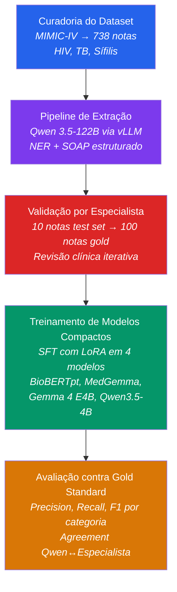
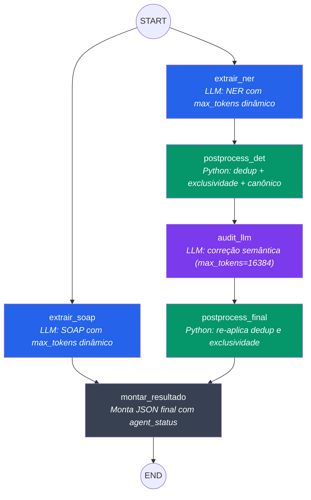

# Documentação da Pipeline de Extração Clínica — Projeto IANA

## 1. Visão Geral do Projeto

O Programa de Eliminação Tripla, adotado pelo Brasil como compromisso junto à Organização Pan-Americana de Saúde (OPAS), visa a eliminação simultânea da transmissão vertical de HIV, Sífilis e Hepatite B até 2030, além da eliminação da Tuberculose como problema de saúde pública. A vigilância epidemiológica dessas três doenças depende, em grande medida, de dados clínicos estruturados que são sistematicamente subextraídos de prontuários eletrônicos. Resumos de alta hospitalar, por exemplo, contêm informações ricas sobre diagnósticos, exames laboratoriais, medicações, procedimentos e evolução clínica — mas estão redigidos em texto livre, sem padronização, e em muitos contextos institucionais sequer são codificados além dos códigos CID de faturamento.

A lacuna que o Projeto IANA preenche está na intersecção entre Processamento de Linguagem Natural (PLN) clínico e vigilância epidemiológica: não existem, até o momento da escrita, pipelines validadas para extração estruturada de informação clínica em português brasileiro especificamente voltadas para HIV, Tuberculose e Sífilis. As ferramentas existentes de NER biomédico operam predominantemente em inglês e em domínios oncológicos ou farmacológicos, com baixa transferibilidade para doenças infecciosas tropicais e para a terminologia médica brasileira.

A contribuição principal do projeto é uma pipeline de anotação semi-automatizada que utiliza um Large Language Model (LLM) de 122 bilhões de parâmetros (Qwen 3.5-122B-A10B) como gerador de silver standard, seguida de validação por especialista médico, para produzir um dataset de treinamento que foi usado para fine-tuning de quatro modelos compactos: BioBERTpt-clin, MedGemma 4B, Gemma 4 E4B e Qwen3.5-4B. Um quinto candidato (GLiNER multi v2.1) foi avaliado mas excluído do benchmark por incompatibilidade de alinhamento de spans entre silver standard (português) e texto original (inglês), com detalhamento técnico em `experiments/training/README.md`. A avaliação dos quatro modelos contra um gold test set validado por especialista é a contribuição final do trabalho.



---

## 2. Curadoria do Dataset

### 2.1 Fonte de dados

O dataset utilizado é o MIMIC-IV-Note v2.2 (Medical Information Mart for Intensive Care), um repositório público de registros clínicos desidentificados do Beth Israel Deaconess Medical Center, disponibilizado via PhysioNet sob licença credenciada. O MIMIC-IV contém mais de 331.000 resumos de alta hospitalar (*discharge summaries*) redigidos em inglês, cobrindo admissões de unidades de terapia intensiva e enfermarias gerais. A escolha do MIMIC-IV como fonte se deve a três fatores: (i) disponibilidade pública que permite reprodutibilidade, (ii) escala suficiente para filtrar subconjuntos por doença específica, e (iii) qualidade da desidentificação, que substitui informações pessoais por marcadores `___` padronizados.

### 2.2 Filtro por doença alvo

A seleção do subconjunto relevante foi realizada em duas etapas. Primeiro, foram identificadas todas as admissões cujo código CID-10 (ou CID-9, para registros mais antigos) correspondia a uma das três doenças alvo:

| Doença | Códigos CID | Exemplos |
|--------|------------|----------|
| HIV | 042, B20 | HIV disease resulting in infectious/parasitic diseases |
| Tuberculose | A18*, A19* | Tuberculosis of other organs, Miliary tuberculosis |
| Sífilis | 091*, 092*, 093*, 094*, 097*, A52* | Early syphilis, Neurosyphilis, Late syphilis |

Segundo, aplicou-se a restrição `seq_num == 1`, que seleciona apenas admissões em que a doença alvo aparece como diagnóstico principal (primeiro da lista de diagnósticos de alta). Essa restrição visa garantir que a nota clínica trate predominantemente da doença de interesse, e não a mencione apenas como comorbidade incidental. Em termos práticos, um paciente internado por pneumonia bacteriana que também tem HIV como comorbidade seria filtrado apenas se o código HIV aparecesse como `seq_num == 1` — caso contrário, a nota seria excluída do corpus de HIV. O resultado foi um corpus de 749 notas clínicas.

A distribuição inicial por doença reflete a prevalência relativa dessas condições em um hospital terciário americano: HIV domina o corpus com 618 notas (~82%), seguido por Tuberculose com 66 notas (~9%) e Sífilis com 65 notas (~9%). Essa assimetria é esperada e não foi corrigida por subamostragem — o objetivo é refletir a distribuição real de resumos de alta disponíveis, não criar classes balanceadas artificialmente.

### 2.3 Auditoria de cobertura textual

A restrição por código CID garante relevância administrativa, mas não garante relevância narrativa. Um código CID pode ser atribuído para fins de faturamento mesmo quando a doença não é discutida no corpo do texto. Para verificar essa hipótese, foi desenvolvido o script `audit_text_coverage.py`, que aplica expressões regulares *case-insensitive* específicas por doença no corpo do texto de cada nota, contando o número de menções textuais à doença alvo. Os padrões incluem:

- **HIV**: termos como `hiv`, `aids`, `cd4`, `antiretroviral`, `haart`, além de nomes de antirretrovirais específicos (tenofovir, emtricitabine, dolutegravir, etc.)
- **Tuberculose**: `tuberculosis`, `tb`, `mycobacterium`, `ppd`, `quantiferon`, `afb`, `isoniazid`, `rifampin`, entre outros
- **Sífilis**: `syphilis`, `treponema`, `rpr`, `vdrl`, `fta-abs`, `penicillin g benzathine`, entre outros

A auditoria revelou que 735 das 749 notas (98,1%) possuíam cobertura textual adequada (≥3 menções), 3 notas (0,4%) possuíam cobertura mínima (1-2 menções), e 11 notas (1,5%) não continham nenhuma menção textual à doença alvo.

| Métrica | Valor |
|---------|-------|
| Total de notas auditadas | 749 |
| Cobertura adequada (≥3 menções) | 735 (98,1%) |
| Cobertura mínima (1-2 menções) | 3 (0,4%) |
| Zero menções | 11 (1,5%) |

As 11 notas com zero menções eram predominantemente casos de neurossífilis latente (10 notas com código 0940 ou A5216) e um caso de HIV (código B20). Nesses casos, o código CID havia sido atribuído por razões administrativas, mas o texto da nota tratava de condições secundárias — por exemplo, a nota `27306123` tinha código de neurossífilis mas descrevia exclusivamente um caso de pé de Charcot com neuropatia periférica, sem qualquer menção a sífilis em todo o documento.

### 2.4 Decisão de exclusão e caso patológico

As 11 notas foram excluídas do dataset de produção, com uma exceção deliberada: a nota `27306123` foi mantida no test set de 10 notas como caso patológico de validação. O objetivo era verificar se a pipeline, ao processar uma nota que não menciona sífilis, retornaria corretamente listas vazias ou apenas as condições reais do paciente — em vez de inventar entidades de sífilis com base no código CID. Os identificadores das notas excluídas estão registrados em `config/excluded_notes.py` e são filtrados automaticamente pelo módulo de carregamento de dados (`graphs/batch.py`).

O dataset final de produção contém 738 notas. A distribuição por doença é:

| Doença | Notas | % do total |
|--------|-------|-----------|
| HIV | ~607 | ~82% |
| Tuberculose | ~66 | ~9% |
| Sífilis | ~65 | ~9% |
| **Total** | **738** | **100%** |

---

## 3. Arquitetura da Pipeline de Extração

### 3.1 Decisão arquitetural — Por que dois agentes paralelos?

A pipeline de extração opera sobre cada nota clínica com dois agentes LLM independentes que executam em paralelo: um extrator de entidades nomeadas (NER) e um estruturador SOAP. Essa separação é uma decisão arquitetural intencional, não uma limitação técnica. A alternativa — um único agente que produz NER e SOAP simultaneamente — foi considerada e rejeitada por três razões.

Primeiro, a separação evita vazamento semântico entre as duas tarefas. Se o mesmo agente produzisse NER e SOAP, a geração do SOAP poderia "contaminar" o NER: por exemplo, ao estruturar o campo *avaliação* do SOAP, o modelo poderia inferir diagnósticos que não estão explícitos no texto e incluí-los retroativamente na lista de doenças do NER. Com agentes separados, cada um lê o texto bruto original independentemente, sem acesso à saída do outro.

Segundo, a execução paralela reduz a latência total. Como NER e SOAP não dependem um do outro, o framework LangGraph executa ambos simultaneamente. O tempo de processamento por nota é determinado pelo agente mais lento (tipicamente o SOAP, que gera textos mais longos), não pela soma dos dois.

Terceiro, a separação permite tratamento de falhas independente. Se o agente NER falhar por estouro de tokens em uma nota muito longa, o SOAP ainda é preservado — e o status do NER é marcado como `token_overflow` sem comprometer o resultado parcial.

### 3.2 Schema de entidades (NER)

O schema de extração de entidades nomeadas é definido no modelo Pydantic `EntidadeClinica` (`models/schemas.py`) com seis categorias, inspiradas na taxonomia do SemClinBr (corpus de anotação clínica em português brasileiro) e adaptadas para as especificidades das três doenças alvo:

**`disease_or_syndrome`** — Diagnósticos, comorbidades e condições clínicas formalmente estabelecidas no paciente. As fontes textuais válidas são: seção *Discharge Diagnosis*, *Past Medical History*, e condições formalmente atribuídas no *Brief Hospital Course*. Achados laboratoriais (leucocitose, trombocitopenia), achados físicos (esplenomegalia, linfadenopatia), achados de imagem (nódulos pulmonares, desvio de linha média) e achados dermatológicos (rash, xerose) são explicitamente excluídos dessa categoria, mesmo quando parecem semanticamente próximos de diagnósticos. A decisão de excluir achados foi motivada por achados sistemáticos na revisão por especialista, onde termos como "Leucocitose" e "Esplenomegalia" estavam sendo consistentemente colocados em `disease_or_syndrome` pelo modelo.

**`sign_or_symptom`** — Sinais e sintomas afirmativamente presentes, relatados pelo paciente ou observados no exame físico. Sintomas negados pelo paciente (ex: "denies fever") não são extraídos. Achados físicos (esplenomegalia, hepatomegalia), achados de imagem (nódulos, massas) e achados dermatológicos (rash, erupções) são categorizados aqui, não em `disease_or_syndrome`.

**`pharmacologic_substance`** — Todos os medicamentos citados no prontuário, incluindo medicações da admissão, do curso hospitalar e da alta. Nome e dosagem são incluídos quando disponíveis. Sinônimos e nomes comerciais são normalizados para uma forma canônica (ex: "Bactrim" e "TMP-SMX" → "Sulfametoxazol-Trimetoprima").

**`laboratory_or_test_result`** — Resultados de análises realizadas em amostras biológicas (sangue, urina, líquor, escarro, tecido), incluindo nome do teste e resultado juntos (ex: "WBC-11.5", "CD4-113", "RPR-Negativo"). Testes com resultado negativo ou pendente são incluídos nesta categoria preservando o resultado (ex: "HIV-Negativo", "Brucella anticorpos-Pendente"), mas a doença ou organismo correspondente não é extraído nas categorias `disease_or_syndrome` ou `organism_or_virus`. Sinais vitais medidos à beira do leito (temperatura, pressão arterial, SpO2 por oximetria) não são incluídos aqui — pertencem ao campo SOAP `objetivo_exame_fisico`. Gasometria arterial, por ser processada em laboratório, é classificada como resultado laboratorial.

**`diagnostic_procedure`** — Exclusivamente procedimentos cujo propósito é investigar ou diagnosticar, envolvendo manipulação direta do paciente. Inclui exames de imagem (TC, RM, raio-X), endoscopias diagnósticas, biópsias, punções lombares e exames funcionais (ECG, ecocardiograma). Procedimentos terapêuticos (cirurgias, amputações), anestésicos (cateter epidural), de suporte de vida (intubação) e cuidados de rotina (inserção de sonda) são explicitamente excluídos — simplesmente não são extraídos em nenhuma categoria do NER. Essa distinção foi refinada após a revisão por especialista, que identificou que termos como "Amputação abaixo do joelho" e "Colocação de cateter epidural" estavam sendo indevidamente classificados como procedimentos diagnósticos.

**`organism_or_virus`** — Somente microrganismos confirmados como causa ativa ou suspeita ativa da condição do paciente. A categorização segue três níveis: Nível 1 (extrair), quando o organismo é confirmado por teste positivo (ex: *Pneumocystis jirovecii* com lavagem broncoalveolar positiva, *Toxoplasma gondii* confirmado por biópsia); Nível 2 (não extrair aqui), quando o organismo foi testado e descartado — nesse caso, o resultado do teste fica em `laboratory_or_test_result` como "AFB-Negativo" ou "Cultura para M. tuberculosis-Sem crescimento"; Nível 3 (não extrair em nenhuma categoria), quando o organismo aparece em hipótese descartada ou histórico tratado sem relevância atual. Há uma distinção explícita entre nome da doença e nome do organismo: "Hepatite B" é doença (`disease_or_syndrome`), enquanto "Vírus da Hepatite B (HBV)" é organismo (`organism_or_virus`) — mas somente se confirmado como ativo. Essa distinção é frequentemente confundida pelo modelo e constitui um dos focos principais do auditor LLM.

### 3.3 Schema de estruturação SOAP

O schema SOAP é definido no modelo Pydantic `SOAP` (`models/schemas.py`) com seis campos, expandindo a estrutura tradicional de quatro campos (Subjetivo, Objetivo, Avaliação, Plano) para seis, pela subdivisão do campo Objetivo em três subcampos especializados:

| Campo | Conteúdo | Origem textual típica |
|-------|----------|----------------------|
| `subjetivo` | Queixa principal, história da doença atual, revisão de sistemas, antecedentes | *Chief Complaint*, *HPI*, *ROS*, *PMH* |
| `objetivo_exame_fisico` | Sinais vitais (T, PA, FC, FR, SpO2), achados do exame físico | *Physical Exam*, *Vitals* |
| `objetivo_laboratorio` | Resultados laboratoriais individuais com valores numéricos | *Pertinent Results*, *Labs* |
| `objetivo_imagem` | Achados e impressões de exames de imagem | *Imaging*, *Radiology* |
| `avaliacao` | Raciocínio clínico, diagnósticos, diferenciais, evolução | *Brief Hospital Course*, *Assessment* |
| `plano` | Medicações de alta, orientações, encaminhamentos, seguimento | *Discharge Medications*, *Discharge Instructions* |

A decisão de subdividir o Objetivo em três subcampos foi motivada pelas necessidades da vigilância epidemiológica: achados de imagem em tuberculose pulmonar (cavitações, nódulos, padrão miliar) têm significado epidemiológico distinto de achados laboratoriais (baciloscopias, culturas, Quantiferon), que por sua vez diferem de achados do exame físico (emagrecimento, linfadenopatia cervical, estertores crepitantes). Agrupá-los em um único campo Objetivo perderia essa granularidade, dificultando análises epidemiológicas que necessitam cruzar, por exemplo, achados radiológicos com resultados microbiológicos para uma mesma coorte.

Uma regra importante foi estabelecida para o campo `subjetivo`: valores numéricos de exames laboratoriais (CD4, carga viral, hemoglobina) nunca devem aparecer neste campo, mesmo quando o paciente menciona conhecê-los. O campo subjetivo é exclusivamente para informações narradas pelo paciente ou acompanhante — queixa principal, história da doença atual, revisão de sistemas, antecedentes pessoais e familiares. Se o paciente diz "sei que meu CD4 está baixo", a documentação no subjetivo deve conter "Paciente refere conhecimento de imunossupressão", enquanto o valor numérico "CD4-46" pertence ao campo `objetivo_laboratorio`. Essa regra foi adicionada na versão 3.2 após o especialista identificar valores de CD4 e carga viral aparecendo no campo subjetivo em duas das 10 notas do test set.

### 3.4 Pós-processamento determinístico

O módulo `postprocess.py` implementa três funções de limpeza que são aplicadas deterministicamente (sem envolver LLM) sobre a saída do agente NER, tanto antes quanto depois da auditoria LLM:

A primeira função, `deduplicate_within_category`, remove duplicatas exatas e quase-exatas dentro de cada categoria. A comparação é *case-insensitive* e ignora diferenças de acentuação e espaçamento. Por exemplo, "Hipertensão" e "hipertensão" são consideradas duplicatas e apenas uma é mantida.

A segunda função, `enforce_mutual_exclusivity`, verifica se uma mesma entidade aparece em mais de uma categoria e, quando há conflito, mantém a entidade na categoria de maior precedência. A ordem de precedência é: `laboratory_or_test_result` > `organism_or_virus` > `diagnostic_procedure` > `disease_or_syndrome` > `sign_or_symptom`. Essa hierarquia reflete a regra de que resultados laboratoriais têm a maior especificidade de categorização (um valor numérico é inequivocamente laboratorial), enquanto sinais e sintomas têm a menor (muitos termos podem ser ambíguos entre sintoma e diagnóstico).

A terceira função, `normalize_canonical_terms`, aplica o dicionário de termos canônicos definido em `config/canonical_terms.py`, que contém aproximadamente 80 mapeamentos. Cada mapeamento associa uma variação (sinônimo, abreviação, nome comercial, forma em inglês) à forma canônica desejada em português brasileiro. Por exemplo, "Bactrim", "TMP-SMX" e "Cotrimoxazol" são todos normalizados para "Sulfametoxazol-Trimetoprima"; "HTN" e "Hipertensão" são normalizados para "Hipertensão arterial sistêmica".

A razão para separar a limpeza em etapas determinísticas e LLM é pragmática: regras de deduplicação e normalização são claras e não requerem julgamento contextual — um dicionário e uma comparação textual bastam. Já a correção de categorização incorreta (ex: decidir se "Esplenomegalia" num contexto específico é achado ou diagnóstico) requer compreensão semântica do texto, que é delegada ao auditor LLM.

### 3.5 Auditor LLM

O nó `audit_quality_llm` no grafo recebe o NER já pós-processado deterministicamente e o texto original da nota, e retorna uma versão corrigida do `EntidadeClinica`. O auditor existe para resolver ambiguidades semânticas que as regras determinísticas não conseguem capturar: por exemplo, "Edema cerebral" pode ser um achado de imagem (quando descrito em um laudo de TC) ou um diagnóstico clínico (quando listado como causa do óbito). A decisão depende do contexto clínico da nota.

O prompt do auditor (`PROMPT_AUDIT_QUALITY` em `config/prompts.py`) é intencionalmente conciso e orientado a output. Em vez de pedir uma análise detalhada com justificativas, o prompt instrui o modelo a retornar diretamente as seis listas corrigidas no formato `EntidadeClinica`. Isso reduz o consumo de tokens de output e minimiza o risco de estouro. O auditor recebe `max_tokens=16384`, dobro do default dos agentes NER e SOAP, para acomodar NERs com muitas entidades.

O principal desafio do auditor é que o tamanho da saída cresce com o número de entidades no NER de entrada. Em notas com 100+ entidades (como as notas HIV complexas), o auditor precisa reproduzir todas as seis listas inteiras na saída, mesmo que tenha feito apenas 3-4 correções. Isso levou a estouros de tokens em aproximadamente 5-15% das notas no test batch. A solução adotada foi um fallback graceful: quando o auditor estoura tokens, a nota mantém o NER pós-processado deterministicamente (que já é substancialmente melhor que o NER bruto) e o status é marcado como `token_overflow` nos metadados do resultado. Essa nota fica registrada em `logs/failed_notes.jsonl` para eventual reprocessamento futuro.

As métricas observadas no test batch mostraram que o auditor faz mudanças em 8-9 de cada 10 notas processadas, com uma média de 50-100 mudanças por nota (incluindo adições, remoções e recategorizações). O percentual médio de `max_tokens` utilizado ficou em torno de 10-30%, indicando que para a maioria das notas o auditor opera com folga confortável.

### 3.6 Diagrama do grafo LangGraph

A pipeline completa por nota é orquestrada como um grafo dirigido acíclico (DAG) pelo framework LangGraph, com seis nós e execução parcialmente paralela:



Os nós `extrair_ner` e `extrair_soap` executam em paralelo a partir do nó START. Após a conclusão do NER, a saída passa sequencialmente pelo pós-processamento determinístico, auditoria LLM e pós-processamento final. O nó `montar_resultado` aguarda a conclusão de ambos os fluxos (NER pós-processado e SOAP) antes de montar o JSON de saída. O pós-processamento final é necessário porque o auditor LLM pode reintroduzir duplicatas ou inconsistências que as regras determinísticas eliminam.

O código do grafo está em `graphs/extracao.py`. A função `criar_grafo_extracao(llm)` recebe a instância do LLM e retorna o grafo compilado, pronto para execução via `.invoke()` ou `.stream()`.

### 3.7 Tratamento de status por agente

Cada nota processada carrega, além do NER e SOAP, um objeto `AgentStatus` que registra o resultado de execução de cada agente. O modelo Pydantic `AgentStatus` (`models/schemas.py`) define três campos de status e três campos de mensagem de erro:

| Campo | Valores possíveis | Significado |
|-------|-------------------|-------------|
| `ner_status` | `ok`, `token_overflow`, `error`, `skipped` | Resultado do agente NER |
| `soap_status` | `ok`, `token_overflow`, `error`, `skipped` | Resultado do agente SOAP |
| `audit_status` | `ok`, `token_overflow`, `error`, `skipped`, `not_needed` | Resultado do auditor LLM |

O valor `not_needed` aparece quando o NER de entrada está completamente vazio (0 entidades), indicando que não há o que auditar. O valor `token_overflow` indica que o agente excedeu o limite de tokens de saída — a nota tem resultado parcial mas não completo. O valor `error` indica falha por outra razão (timeout, erro de conexão, etc.).

Essa rastreabilidade explícita foi introduzida na versão 3.0 da pipeline, após a descoberta de que a versão 2.0 reportava falsos positivos: notas com NER vazio (por falha silenciosa do vLLM) eram reportadas como processadas com sucesso. O status por agente permite que o relatório de produção distinga entre "nota processada com 0 entidades porque o texto não contém informações clínicas" e "nota processada com 0 entidades porque o agente NER estourou tokens".

### 3.8 Escalonamento dinâmico de tokens

O parâmetro `max_tokens` controla o número máximo de tokens que o modelo pode gerar na resposta. Esse valor precisa acomodar o tamanho da saída esperada, que por sua vez depende da riqueza clínica da nota de entrada. Uma nota de 5.000 caracteres sobre uma admissão simples pode gerar um NER com 20 entidades, enquanto uma nota de 50.000 caracteres sobre um caso complexo de HIV com múltiplas comorbidades pode gerar um NER com 200+ entidades.

A função `_calcular_max_tokens` em `graphs/extracao.py` implementa um escalonamento em quatro faixas:

| Tamanho do input | max_tokens alocado | Justificativa |
|------------------|--------------------|---------------|
| < 15.000 chars | 16.384 | Notas curtas, saída tipicamente < 4K tokens |
| 15.000 – 30.000 chars | 24.576 | Notas médias, headroom para entidades extras |
| 30.000 – 45.000 chars | 32.768 | Notas longas, comuns em HIV complexo |
| ≥ 45.000 chars | 49.152 | Notas gigantes (ex: TB miliar com 52K chars) |

A quarta faixa (49.152 tokens) foi adicionada na versão 3.2 após a nota `20250010` (TB miliar, 52.677 caracteres) esgotar o teto anterior de 32.768 tokens no agente NER, resultando em 0 entidades extraídas. O auditor LLM usa um valor fixo de 16.384 tokens independentemente do tamanho da nota, com fallback para o NER pós-processado se estourar.

---

## 4. Infraestrutura e Configuração

### 4.1 Hardware

A inferência foi realizada em uma estação NVIDIA DGX equipada com três GPUs NVIDIA H200 SXM (143 GiB HBM3e cada, 429 GiB totais), interconectadas via NVLink. Apenas duas das três GPUs são utilizadas pelo servidor de inferência, devido a uma limitação de divisibilidade do tensor parallelism: o modelo Qwen 3.5-122B-A10B possui 64 *experts* em sua arquitetura Mixture-of-Experts (MoE), e 64 não é divisível por 3. A terceira GPU permanece disponível para outros usos ou para futuro pipeline parallelism.

### 4.2 Modelo de inferência

O modelo selecionado é o Qwen 3.5-122B-A10B (Qwen Team, 2025), uma arquitetura Mixture-of-Experts com 122 bilhões de parâmetros totais e aproximadamente 10 bilhões de parâmetros ativos por token. O modelo utiliza Gated DeltaNet (GDN) como mecanismo de atenção linear em 75% de suas camadas, resultando em crescimento reduzido da cache KV em comparação com arquiteturas Transformer tradicionais — vantagem crítica para processar notas clínicas longas (até 65.536 tokens de contexto).

O modelo é servido pelo vLLM v0.18.0, um motor de inferência de alto throughput, com a seguinte configuração:

```bash
vllm serve Qwen/Qwen3.5-122B-A10B \
    --tensor-parallel-size 2 \
    --quantization fp8 \
    --max-model-len 65536 \
    --host 0.0.0.0 \
    --port 8000 \
    --api-key iana-local-key \
    --gdn-prefill-backend triton
```

A quantização FP8 (pesos e ativações em 8 bits) reduz o uso de memória de ~244 GiB (BF16) para ~122 GiB, liberando ~158 GiB para a cache KV e permitindo a janela de contexto completa de 65K tokens. A flag `--gdn-prefill-backend triton` direciona o processamento GDN para o backend Triton, evitando a compilação JIT do FlashInfer que requer `nvcc` (não disponível no ambiente containerizado da DGX).

O cliente Python conecta-se ao servidor vLLM via a classe `ChatOpenAI` do LangChain, que é compatível com a API OpenAI exposta pelo vLLM:

```python
llm = ChatOpenAI(
    base_url="http://localhost:8000/v1",
    api_key="iana-local-key",
    model="Qwen/Qwen3.5-122B-A10B",
    temperature=0.1,
    max_tokens=16384,
    extra_body={"chat_template_kwargs": {"enable_thinking": False}},
    timeout=120,
)
```

O parâmetro `enable_thinking=False` desabilita o modo de raciocínio do Qwen 3.5, que gera tokens de cadeia de pensamento (*chain-of-thought*) antes da resposta estruturada. Sem essa flag, o modelo consumia o budget de tokens gerando raciocínio interno, esgotando o `max_tokens` antes de produzir o JSON de saída.

### 4.3 Stack de software

A pipeline é implementada em Python 3.12 com as seguintes dependências principais: LangGraph 1.x para orquestração do grafo de agentes, LangChain e LangChain-OpenAI para a interface com o LLM, Pydantic v2 para validação de schemas, Polars para manipulação eficiente de dados tabulares em formato Apache Parquet, e logging estruturado em JSON via módulo `logging` da biblioteca padrão (sem uso de `print` nos módulos novos). O código-fonte é organizado como um monorepo com estrutura modular em `experiments/`.

---

## 5. Processo Iterativo de Validação — A História da Pipeline

### 5.1 Test set estratificado

Antes de executar a pipeline nas 738 notas do dataset de produção, selecionou-se um test set de 10 notas estratificadas por doença e complexidade clínica. A seleção foi realizada pelo script `select_test_samples.py`, que computa um score de complexidade para cada nota baseado em: tamanho do texto (em caracteres), número de menções à doença alvo (do CSV de auditoria de cobertura), número de termos de negação, número de testes pendentes, número de diagnósticos diferenciais, presença de terapia antirretroviral (HAART), e presença de testes de TB (Quantiferon, PPD, AFB). O orientador selecionou as 10 notas finais a partir das candidatas ranqueadas.

| ID | Doença | Categoria | Chars | Observação |
|-----|--------|-----------|-------|------------|
| 25557330 | HIV | Complexa | 24.805 | 51 menções, 18 diferenciais, HAART+TB |
| 22924630 | HIV | Complexa | 49.602 | Contexto longo, múltiplas comorbidades |
| 24918106 | HIV | Simples | 10.731 | 6 menções, sem negações |
| 22413631 | HIV | Simples | 7.350 | Validação de não-regressão |
| 23080963 | Sífilis | Adequada | 20.183 | 46 testes pendentes |
| 22978216 | Sífilis | Adequada | 12.990 | 21 negações, coinfecção HIV |
| 27306123 | Sífilis | Caso patológico | 8.929 | Zero menções de sífilis no texto |
| 20250010 | TB | Complexa | 52.677 | 17 diferenciais, TB miliar A199 |
| 27321074 | TB | Complexa | 26.511 | TB do SNC A1781, HAART+TB |
| 20248623 | TB | Simples | 8.182 | TB pleural A182 |

### 5.2 Round 1 — Falha silenciosa de infraestrutura

A primeira tentativa de processamento do test set falhou de forma invisível. As 10 notas foram reportadas como processadas com sucesso ("ok"), mas cada uma continha 0 entidades extraídas e SOAP vazio. O tempo de processamento por nota era de ~1,5 segundos — suspeitamente rápido para um modelo de 122B parâmetros (o tempo esperado era de ~40-70 segundos). A investigação revelou que o servidor vLLM não estava respondendo na porta esperada — o processo havia sido encerrado quando a sessão SSH foi fechada. Os `try/except` nos nós do grafo capturaram silenciosamente os erros de conexão e retornaram objetos vazios.

Essa falha gerou duas lições. A primeira, operacional: o servidor vLLM precisa ser executado com `nohup` para persistir além da sessão SSH. A segunda, arquitetural: o pipeline precisava de uma rede de proteção contra falhas de infraestrutura que não são falhas clínicas. O status técnico ("processamento concluído") não pode ser confundido com qualidade do output ("extração produziu resultados válidos"). Essa lição levou à implementação do modelo `AgentStatus` descrito na seção 3.7.

### 5.3 Round 2 — Estouros de tokens em notas longas

Após a correção da infraestrutura (vLLM rodando de forma persistente), o test batch foi reprocessado com sucesso parcial. Sete das 10 notas processaram completamente (NER + SOAP + Auditor), mas quatro apresentaram estouro de tokens em pelo menos um agente:

- Nota `22924630` (49.602 chars, HIV complexa): SOAP estourou `max_tokens`
- Nota `27321074` (26.511 chars, TB complexa): SOAP estourou `max_tokens`
- Nota `20250010` (52.677 chars, TB complexa): NER estourou `max_tokens`, ficou com 0 entidades
- Nota `25557330` (24.805 chars, HIV complexa): Auditor LLM estourou após 115 segundos

A causa raiz era o `max_tokens=16384` fixo para todos os agentes, insuficiente para notas longas cujo output estruturado (especialmente o NER com 100+ entidades) excede esse limite. O validador automático (`validate_extraction_quality.py`) identificou 15 issues residuais nos resultados, distribuídos entre violações de idioma (8), sintomas em `disease_or_syndrome` (3), achados de imagem em `disease_or_syndrome` (2) e vazamento de testes negativos (2).

Esse round motivou três correções: escalonamento dinâmico de `max_tokens` baseado no tamanho do input, fallback graceful do auditor com status explícito, e status por agente em cada nota processada.

### 5.4 Round 3 — Correção da arquitetura híbrida

Com as correções implementadas (max_tokens dinâmico, fallback do auditor, status explícito), o test batch foi reprocessado. Todas as 10 notas obtiveram NER e SOAP com sucesso (10/10). O auditor falhou em 2 das 10 notas (25557330 e 20250010) — ambas com mais de 100 entidades — mas com fallback explícito para o NER pós-processado, o resultado parcial ficou preservado. O validador automático caiu de 15 para 4 issues, e 7 das 10 notas ficaram completamente limpas.

### 5.5 Round 4 — Descoberta da alucinação de sintomas

Um achado crítico emergiu da análise detalhada da nota `22413631` (HIV simples, 7.350 chars). Essa nota havia sido processada com sucesso (status "ok" em todos os agentes), com 74 entidades extraídas. Porém, uma inspeção manual revelou que a lista de sinais e sintomas continha **44 itens**, quando o texto original mencionava apenas cerca de 6 sintomas afirmativamente presentes.

A investigação mostrou que os 38 itens extras vinham de seções de *Review of Systems* (ROS) e exame físico onde os itens eram **negados** no texto original: "No fever, chills, night sweats" gerava as entidades "Febre", "Calafrios" e "Suores noturnos" como se fossem presentes. "No abnormal movements, tremors" gerava "Tremores". "No nystagmus" gerava "Nistagmo". "No dysarthria or paraphasic errors" gerava "Disartria" e "Erros parafásicos".

O problema estava na instrução original do prompt, que dizia "extraia TODOS os sinais e sintomas" sem ênfase suficiente na verificação de polaridade (positivo vs negado). O modelo, treinado para ser exaustivo, interpretava literalmente a presença do termo no texto sem verificar se estava afirmado ou negado.

A correção envolveu três reforços no prompt do NER. Primeiro, uma nova seção "REGRA FUNDAMENTAL: EXTRAÇÃO LITERAL" estabelecendo que cada entidade extraída deve ter evidência textual direta e positiva no texto original. Segundo, uma lista expandida de exemplos de negação clínica ("No X", "Denies Y", "Without Z", "Sem A") com instrução explícita de não extrair. Terceiro, uma "REGRA ANTI-ALUCINAÇÃO" instruindo o modelo a perguntar, antes de incluir qualquer item: "Existe uma frase no texto original que afirma POSITIVAMENTE a presença disto neste paciente?". O auditor LLM recebeu reforço análogo, com a verificação anti-alucinação como check #0 (primeiro a ser executado).

O resultado da correção foi dramático: a nota `22413631` caiu de 74 para 33 entidades, com apenas 8 sintomas reais (contra 44 inflados). As demais notas apresentaram reduções proporcionais na contagem de sintomas sem perda de entidades legítimas.

### 5.6 Round 5 — Revisão por especialista médico

Após a estabilização da versão 3.1, foi gerado material de revisão para avaliação clínica formal. O script `generate_medical_review.py` produziu 10 arquivos HTML formatados — um por nota — contendo: o texto original da nota em fonte monoespaçada, o NER extraído organizado por categoria com contagens, o SOAP estruturado em seis campos com cabeçalhos coloridos, e uma tabela vazia para anotação de erros pelo especialista. Um arquivo índice (`index.html`) com links para os 10 arquivos e tabela resumo completava o material.

O especialista médico revisou 9 das 10 notas (a nota `20250010` não foi revisada porque o NER havia estourado tokens naquela versão, ficando com 0 entidades). O total de issues apontados foi de aproximadamente 35, distribuídos da seguinte forma:

| Tipo de erro | Ocorrências | % do total |
|-------------|------------|-----------|
| Categoria errada (doença vs achado) | ~25 | ~71% |
| Invenção de entidade | ~3 | ~9% |
| Omissão (PMH) | ~3 | ~9% |
| Erro de tradução | ~1 | ~3% |
| Extração desnecessária (nota patológica) | ~3 | ~9% |

O achado mais significativo foi que **nenhum erro foi classificado como severo** pelo especialista. A coluna "Severidade" da tabela de anotação ficou em branco em todos os casos, sugerindo que os erros são refinamentos taxonômicos (qual categoria uma entidade deve ocupar), não erros clínicos graves (extração de informação factualmente incorreta que poderia levar a decisões clínicas equivocadas). Esse é um resultado encorajador para o uso do silver standard no treinamento de modelos compactos: mesmo onde o Qwen erra, erra de forma não-crítica.

O padrão dominante era a confusão entre `disease_or_syndrome` e achados, responsável por 71% dos issues (~25 de ~35). Termos como "Leucocitose", "Trombocitopenia", "Hiponatremia", "Esplenomegalia", "Nódulos pulmonares", "Desvio de linha média", "Transaminitis" e "Rash hipopigmentado" estavam sendo sistematicamente colocados em `disease_or_syndrome` quando deveriam ser classificados como achados laboratoriais (leucocitose é uma contagem elevada de leucócitos, não uma doença), achados físicos (esplenomegalia é um sinal palpável, não um diagnóstico), achados de imagem (nódulos pulmonares são descrições radiológicas, não entidades nosológicas) ou achados dermatológicos (rash é um sinal cutâneo, não uma doença). Esse padrão aparecia em 7 das 9 notas revisadas e era claramente sistemático — não aleatório.

As 3 omissões identificadas concentravam-se no *Past Medical History* (PMH): notas em que o paciente tinha hipertensão, dislipidemia ou depressão listados no PMH, mas o modelo não os extraiu para `disease_or_syndrome`. Aparentemente, o modelo priorizava condições da admissão atual e tratava comorbidades crônicas como informação de contexto, não como entidades extraíveis.

Na nota patológica `27306123` (sífilis sem menção textual), o especialista identificou 3 entidades que o pipeline extraiu desnecessariamente — condições reais do paciente (pé de Charcot, neuropatia) que, embora clinicamente corretas, não constituíam o teste desejado (esperava-se que o pipeline retornasse listas mais enxutas ou vazias para uma nota onde a doença alvo não é mencionada).

### 5.7 Round 6 — Iteração final pré-batch (v3.2)

Baseada na revisão do especialista, a última iteração de correções antes do batch de produção endereçou cinco problemas:

O primeiro e mais extenso foi a **distinção sistemática entre doença e achado**. Uma seção adicional no prompt do NER lista explicitamente dezenas de termos que parecem doenças mas são achados — organizados em quatro grupos (laboratoriais, físicos, de imagem, dermatológicos) — com a categoria correta de destino. A regra de ouro: "se o termo descreve um resultado de exame ou observação descritiva, é achado; se aparece como diagnóstico clínico estabelecido, é doença".

O segundo foi a **distinção entre procedimento diagnóstico e terapêutico**. A categoria `diagnostic_procedure` passou a aceitar exclusivamente procedimentos de investigação. Cirurgias, anestesias, acessos vasculares, suporte de vida e cuidados de rotina foram explicitamente excluídos — não apenas desta categoria, mas de todo o NER (não pertencem a nenhuma das seis categorias definidas).

O terceiro foi a **separação rigorosa entre Subjetivo e Objetivo no SOAP**. Uma regra explícita proíbe a inclusão de valores numéricos de exames no campo `subjetivo`, redirecionando-os para `objetivo_laboratorio`.

O quarto foi a **extração obrigatória do Past Medical History**. Uma seção dedicada no prompt lista comorbidades crônicas comuns (hipertensão, diabetes, dislipidemia, depressão, entre outras) que devem ser sempre extraídas quando presentes no PMH, mesmo que não sejam o foco da admissão.

O quinto foi o **aumento do teto de max_tokens para 49.152** em notas com mais de 45.000 caracteres, endereçando o caso da nota `20250010` (TB miliar, 52.677 chars) que havia estourado na versão anterior.

Após essa iteração, a equipe decidiu pelo processamento do batch completo de 738 notas sem rodadas adicionais de revisão por especialista, considerando a pipeline madura o suficiente para gerar um silver standard de qualidade para treinamento de modelos compactos. O batch de produção foi executado na DGX com o servidor vLLM persistente (via `nohup`), levando aproximadamente 524 minutos (~8,7 horas) para as 738 notas, com tempo médio de 42,6 segundos por nota. Nenhuma nota reportou erro fatal (0 de 738), embora o status por agente revele que uma parcela das notas mais longas caiu no fallback do auditor. Os resultados foram salvos em `resultados/banco_dados_iana_v3.json`, com logs detalhados em `logs/audit_metrics.jsonl` e `logs/failed_notes.jsonl`.

---

## 6. Geração do Material de Revisão

O script `generate_medical_review.py` automatiza a produção de material para revisão clínica. Recebe como entrada o arquivo JSON com resultados da pipeline e o Parquet original do MIMIC-IV (para obter o texto bruto de cada nota), e produz um conjunto de arquivos HTML autocontidos — um por nota mais um índice — no diretório `experiments/resultados/medical_review/`.

Cada arquivo HTML é dividido em quatro seções. O cabeçalho exibe metadados da nota (ID do paciente, doença alvo, código CID, categoria do test set) e o status de cada agente renderizado como badges coloridas (verde para `ok`, amarelo para `token_overflow`, vermelho para `error`). A primeira seção apresenta o texto original da nota em fonte monoespaçada sobre fundo cinza claro, preservando os marcadores de desidentificação (`___`) e com rolagem vertical para notas longas. A segunda seção organiza as seis categorias do NER como listas com bullets, cada uma com seu título traduzido para português e contagem de entidades. A terceira seção apresenta os seis campos SOAP com cabeçalhos coloridos distintos por campo, preservando quebras de linha. A quarta seção contém uma tabela vazia para anotação do especialista, com colunas para categoria, item, tipo de erro, severidade e comentário.

O CSS é embutido no HTML (sem dependências externas), com largura máxima centralizada, tipografia legível, e uma *media query* `@media print` que remove elementos desnecessários para impressão. Para a nota `27306123` (caso patológico de sífilis), um alerta destacado em amarelo é inserido automaticamente abaixo do cabeçalho, informando ao especialista que a nota foi incluída intencionalmente como caso de validação e que o pipeline deveria retornar listas vazias ou apenas as condições reais do paciente.

O script é parametrizável — aceita qualquer arquivo JSON com a mesma estrutura — e será reutilizado para a geração do material de revisão do gold test set de 100 notas na próxima fase do projeto.

---

## 7. Decisões Metodológicas Importantes

### 7.1 Por que Qwen 3.5-122B como silver standard?

A escolha do Qwen 3.5-122B-A10B como modelo gerador do silver standard foi motivada por quatro fatores. Primeiro, é um modelo de código aberto, o que garante reprodutibilidade — qualquer pesquisador com acesso a hardware compatível pode executar a mesma pipeline com pesos idênticos. Segundo, a arquitetura MoE com 10B parâmetros ativos por token oferece desempenho próximo a modelos densos maiores com custo computacional significativamente menor. Terceiro, o modelo demonstra bom desempenho bilíngue (inglês e português), essencial para uma pipeline que lê notas em inglês e produz saída em português brasileiro. Quarto, a compatibilidade com quantização FP8 permite servir o modelo em duas GPUs H200 com contexto de 65K tokens, acomodando as notas clínicas mais longas do dataset.

Alternativas consideradas incluíram: GPT-4o via API da OpenAI (descartado por custo recorrente — estimado em US$ 2.000-5.000 para processar 738 notas com três chamadas LLM por nota —, impossibilidade de execução local, comprometendo reprodutibilidade, e restrições de privacidade na transmissão de dados clínicos para servidores externos, mesmo com dados desidentificados), Claude 3.5 Sonnet via API da Anthropic (mesmas limitações de custo e localidade), e Llama 3.1 70B executado localmente (descartado por desempenho significativamente inferior em português brasileiro e em tarefas de extração estruturada com output em JSON, segundo benchmarks internos preliminares que mostraram ~30% mais erros de categorização e ~50% mais erros de tradução em relação ao Qwen). O Qwen 3.5-122B ofereceu o melhor equilíbrio entre qualidade de extração, suporte ao português, custo computacional fixo (sem cobrança por token), e reprodutibilidade completa.

### 7.2 Por que treinar modelos compactos em vez de usar o Qwen direto?

O Qwen 3.5-122B é um modelo de 122 bilhões de parâmetros que requer pelo menos duas GPUs de alta capacidade (H200 ou A100 de 80GB) para inferência em tempo real. Serviços de saúde pública no Brasil — o público-alvo final dessa tecnologia — não dispõem, em geral, de infraestrutura GPU dessa escala. A contribuição pragmática do projeto é demonstrar que modelos compactos (4B parâmetros), acessíveis em hardware modesto (uma GPU de consumo ou mesmo CPU), podem atingir desempenho próximo ao modelo grande quando treinados por *Supervised Fine-Tuning* (SFT) com LoRA em um silver standard de qualidade.

Os quatro modelos selecionados para o benchmark cobrem diferentes arquiteturas e especializações, permitindo uma comparação multi-dimensional:

| Modelo | Parâmetros | Tipo | Especialização | Justificativa |
|--------|-----------|------|---------------|---------------|
| BioBERTpt-clin | ~110M | Encoder (BERT) | Biomédico PT-BR | Representante de modelos pré-treinados em domínio clínico brasileiro |
| MedGemma 4B | 4B | Decoder (Gemma 3) | Medicina geral | Modelo médico da família Gemma, treinado em dados clínicos |
| Gemma 4 E4B | 7.9B | Decoder (Gemma 4) | Generalista multimodal | Baseline de modelo generalista sem especialização médica; vision/audio towers removidas para treino text-only |
| Qwen3.5-4B | 4B | Decoder (Qwen) | Instruções bilíngue | Versão compacta da mesma família do modelo grande (Qwen 3.5-122B), testando transferência intra-família |

A inclusão do Qwen3.5-4B é particularmente interessante porque permite medir quanto do desempenho do Qwen 122B é transferível para um modelo da mesma família com ~30× menos parâmetros. A inclusão do Gemma 4 E4B como baseline generalista permite isolar a contribuição da especialização médica (comparando com MedGemma). O BioBERTpt-clin representa a abordagem clássica de NER biomédico em português, permitindo comparar com a abordagem generativa.

Um quinto candidato, **GLiNER multi v2.1**, foi avaliado mas excluído do benchmark. O GLiNER requer offsets `(start, end)` no texto original para cada entidade, o que inviabiliza alinhamento quando o silver standard está em português brasileiro canônico e o texto original do MIMIC-IV está em inglês. O fuzzy matching no smoke test obteve match rate de apenas 13.7%, muito abaixo do mínimo operacional. Detalhamento completo em `experiments/training/README.md`.

### 7.3 Por que validar 100 notas como gold antes de treinar?

A avaliação de modelos treinados em silver standard requer um teste contra um padrão independente — caso contrário, estaria-se medindo a capacidade dos modelos compactos de reproduzir erros do modelo grande, não de extrair informação correta. O gold test set de 100 notas será validado manualmente pelo especialista médico: cada entidade extraída será verificada contra o texto original, com correção de categorização, remoção de invenções e adição de omissões. Esse gold set não participa do treinamento — é usado exclusivamente para avaliação.

A escolha de 100 notas (aproximadamente 13,5% do dataset) equilibra dois fatores: representatividade estatística suficiente para calcular métricas robustas por categoria e por doença, e viabilidade prática de validação manual por um único especialista em prazo compatível com o cronograma do projeto. Importante: essa validação ainda não foi realizada no momento da escrita desta documentação — está planejada como próximo passo imediato.

### 7.4 Trade-off entre correção via prompt vs correção via código

Ao longo das seis iterações de validação, ficou evidente que algumas categorias de erro respondem melhor a correções no prompt do LLM, enquanto outras são mais eficientemente tratadas por código determinístico. O princípio adotado foi: regras que podem ser expressas como comparações textuais ou consultas a dicionários vão para código (deduplicação, normalização canônica, verificação de exclusividade mútua); regras que dependem de contexto clínico vão para o prompt (distinção entre achado e diagnóstico, tratamento de negações contextuais, verificação de organismos confirmados).

Na prática, as correções via código são instantâneas (~10ms), determinísticas e auditáveis. As correções via prompt são mais lentas (~25s por nota), probabilísticas e sujeitas a inconsistência entre execuções. O desenho híbrido — código primeiro, LLM depois, código novamente — maximiza as vantagens de ambos: o pós-processamento determinístico inicial elimina os erros mais simples e previsíveis, o auditor LLM resolve as ambiguidades semânticas restantes, e o pós-processamento final garante que a saída do auditor esteja limpa de quaisquer inconsistências reintroduzidas.

---

## 8. Limitações Conhecidas

A pipeline apresenta limitações que devem ser explicitadas para contextualizar a interpretação dos resultados.

O auditor LLM cai em fallback (retornando o NER pós-processado sem auditoria semântica) em aproximadamente 5-15% das notas mais longas. Essas notas retêm o benefício do pós-processamento determinístico mas não passam pela correção semântica. O impacto é uma qualidade ligeiramente inferior nessas notas, concentrada em erros de categorização ambíguos.

As entidades extraídas não possuem rastreabilidade de *spans* ou *offsets* — cada entidade é uma string independente, sem âncora textual indicando a posição exata no texto original onde foi encontrada. Isso limita a possibilidade de avaliação granular e dificulta o treinamento de modelos de NER baseados em sequência (token-level). Para os modelos generativos do benchmark, essa limitação é menos relevante.

Não há score de confiança por entidade. Cada entidade na saída é tratada com igual certeza, sem indicação de quão "certa" a pipeline estava ao extraí-la. Modelos futuros com calibração de incerteza poderiam adicionar essa dimensão.

A categoria `sign_or_symptom` acumula achados de naturezas diversas — sinais clínicos do exame físico, sintomas relatados pelo paciente, achados de imagem e achados dermatológicos. Uma taxonomia mais granular poderia separar essas subcategorias, mas a decisão pragmática foi manter seis categorias totais para evitar esparsidade excessiva no treinamento dos modelos compactos.

O MIMIC-IV contém notas em inglês, e a pipeline traduz para português brasileiro durante a extração. Essa tradução é realizada implicitamente pelo modelo Qwen 3.5 durante a geração do output estruturado — não há uma etapa de tradução separada. Os prompts instruem o modelo a produzir toda saída em "português brasileiro clínico padrão", com exceções permitidas para siglas universais (HIV, CD4, WBC), nomes de testes sem tradução estabelecida (Quantiferon Gold, Western Blot) e nomes científicos em latim (*Mycobacterium tuberculosis*). Não foi realizada uma avaliação independente e sistemática da qualidade dessa tradução. Os erros de tradução observados pelo especialista na revisão das 10 notas foram raros (~3% dos issues, ou ~1 de ~35), tipicamente envolvendo construções híbridas residuais (ex: "Tightness no peito" em vez de "Aperto torácico"). Uma avaliação rigorosa demandaria um avaliador bilíngue com formação médica, recurso não disponível no cronograma atual.

A pipeline não lida com notas incompletas ou corrompidas. Assume-se que todas as notas no MIMIC-IV são resumos de alta completos e validados. Notas truncadas ou com campos ausentes podem gerar extrações parciais sem indicação explícita de incompletude.

O gold test set de 100 notas, que será usado para avaliação final dos modelos compactos, ainda não foi validado pelo especialista no momento da escrita. A avaliação está planejada como trabalho futuro imediato. A ausência dessa validação significa que, até o momento, a qualidade da pipeline foi avaliada qualitativamente em 10 notas por um especialista e automaticamente em 738 notas pelo validador de regras — mas não houve avaliação quantitativa com métricas formais (precision, recall, F1) contra um gold standard humano.

---

## 9. Estado Atual e Trabalho Futuro

### Concluído

1. ✅ **Curadoria do dataset**: 749 notas filtradas por CID-10 → auditoria de cobertura textual → 738 notas no dataset final.

2. ✅ **Pipeline de extração v3.2**: 738 notas processadas em ~10h na DGX (Qwen 3.5-122B via vLLM com FP8), produzindo silver standard em `banco_dados_iana_v3_clean.json` após pós-processamento determinístico.

3. ✅ **Gold test set de 30 notas**: 10 HIV + 10 Tuberculose + 10 Sífilis, selecionadas por estratificação de complexidade. Material HTML gerado para revisão por especialista médico.

4. ✅ **Treinamento dos 4 modelos compactos** via SFT com LoRA (decoders) ou full fine-tuning (BioBERTpt), usando 602 notas de treino + 66 de validação:
   - **BioBERTpt-clin** — Token classification, 3 épocas em ~4 min, F1 val = 0.15
   - **MedGemma 4B** — LoRA r=16, 3 épocas em ~1h, eval_loss = 0.73, accuracy = 0.83
   - **Gemma 4 E4B** — LoRA r=16 (vision/audio towers removidas), 3 épocas em ~36 min, eval_loss = 0.51, accuracy = 0.88
   - **Qwen3.5-4B** — LoRA r=16, 3 épocas em ~4h, eval_loss = 0.71, accuracy = 0.83

   Checkpoints publicados no HuggingFace Hub:
   - `fonteneleantp/iana-biobertpt-ner`
   - `fonteneleantp/iana-medgemma-lora`
   - `fonteneleantp/iana-gemma4-e4b-lora`
   - `fonteneleantp/iana-qwen35-4b-lora`

### Trabalho Futuro Imediato

1. **Validação do gold test set pelo especialista** — Revisão manual das 30 notas pelo Dr. Gregs com correção de categorização, remoção de invenções e adição de omissões.

2. **Avaliação contra gold standard** — Inferência dos 4 modelos treinados nas 30 notas gold. Cálculo de precision, recall e F1 por categoria NER e por doença. Cálculo de agreement entre saída dos modelos compactos, saída do Qwen 122B, e anotação do especialista.

3. **Análise de erro qualitativa** — Investigação dos padrões de erro mais frequentes nos modelos compactos, com atenção especial a: negações vazadas, confusão entre categorias, omissões de entidades raras, e erros de tradução.

4. **Escrita das seções Results e Discussion** do paper.

5. **Submissão ao MDPI Diagnostics**.

---

## 10. Estrutura de Arquivos do Repositório

```
experiments/
├── config/
│   ├── canonical_terms.py          # Dicionário de ~80 mapeamentos canônicos (sinônimos → forma padrão PT-BR)
│   ├── excluded_notes.py           # 11 IDs de notas excluídas por falha de cobertura textual
│   └── prompts.py                  # System prompts dos 3 agentes ativos (NER, SOAP, Auditor) + 2 legacy
├── models/
│   └── schemas.py                  # Modelos Pydantic: EntidadeClinica, SOAP, AgentStatus, EstadoExtracao
├── graphs/
│   ├── extracao.py                 # Grafo LangGraph v3.2 com 6 nós (NER, SOAP, 2× postprocess, audit, montar)
│   └── batch.py                    # Processamento em lote com Map-Reduce via Send() API
├── postprocess.py                  # 3 funções determinísticas para uso DENTRO do grafo (dedup, exclusividade, normalização)
├── postprocess_banco_final.py      # Pós-processamento em LOTE do banco inteiro pós-execução (5 camadas de correção)
├── audit_text_coverage.py          # Auditoria de cobertura textual do dataset (regex por doença)
├── select_test_samples.py          # Seleção estratificada de candidatas para test set (score de complexidade)
├── select_gold_test_set.py         # Seleção do gold test set final de 30 notas (10 HIV + 10 TB + 10 Sífilis)
├── run_test_batch.py               # Processa 10 notas do test set, roda validação, gera relatório MD
├── generate_medical_review.py      # Gera HTMLs formatados para revisão por especialista médico
├── validate_extraction_quality.py  # 8 checks automáticos de qualidade NER (dedup, negação, idioma, etc.)
├── 04_inferencia_langgraph.py      # Script principal de execução: modo amostras (3 notas) ou parquet (738)
├── 05_recuperar_pendentes.py       # Recovery de notas com falha: identifica, reprocessa, merge
├── training/                       # Pipeline de treino dos 4 modelos compactos (SFT com LoRA)
│   ├── config/                     # YAMLs por modelo (hiperparâmetros + LoRA config)
│   ├── data_prep/                  # Split train/val/gold + conversores BIO/ChatML/Gemma
│   ├── train/                      # Scripts de treino individuais + shared (LoRA config, callbacks)
│   ├── eval/                       # Inferência, métricas P/R/F1, comparação entre modelos
│   ├── infra/                      # check_model_access.py + scripts shell (stop/start vLLM, GPU)
│   ├── logs/                       # Logs JSONL de treino por step
│   └── README.md                   # Documentação do pipeline de treino + exclusão GLiNER documentada
├── METHODOLOGY_NOTES.md            # Documentação da divergência entre grafo v2 (4 agentes) e produção (2→6 nós)
├── PIPELINE_DOCUMENTATION.md       # Este documento
├── scripts/
│   └── start_vllm.sh              # Comando de inicialização do servidor vLLM na DGX
├── amostras/                       # 3 notas de teste (.txt) com metadados no nome do arquivo
├── dados/                          # Parquet do MIMIC-IV filtrado (não versionado)
├── resultados/                     # JSONs de saída (silver, silver_clean, gold_test_set), HTMLs de revisão
└── logs/                           # audit_metrics.jsonl, failed_notes.jsonl, postprocess_stats.json
```
